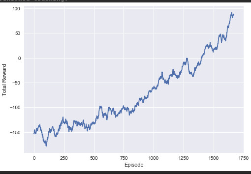

# A2C_TF2.0_Keras_LunarLander

This is a TF2.0 Keras implementation of a A2C Actor Critic agent (tested for openai lunar lander v2)

In this version, a very different model definition was used employing a Keras.Model subclass.

The idea to implement the model and losses this way is from: 

https://medium.com/@Inoryy/deep-reinforcement-learning-with-tensorflow-2-0-d8e62102680d

